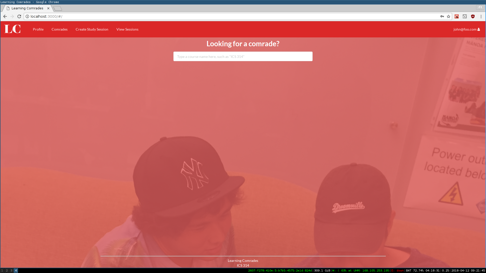
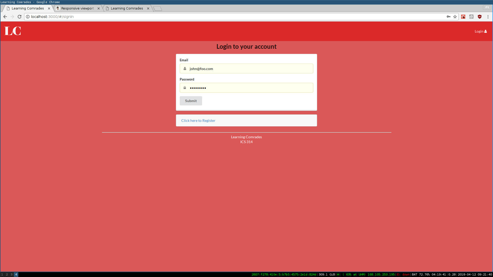
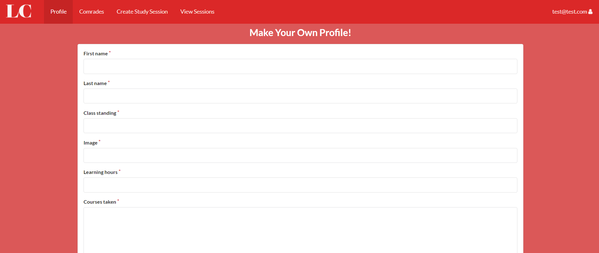
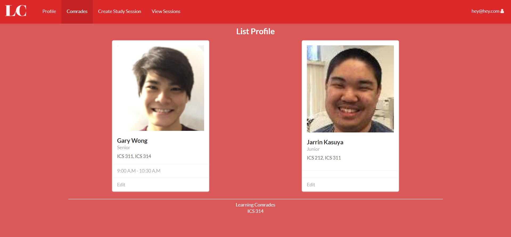
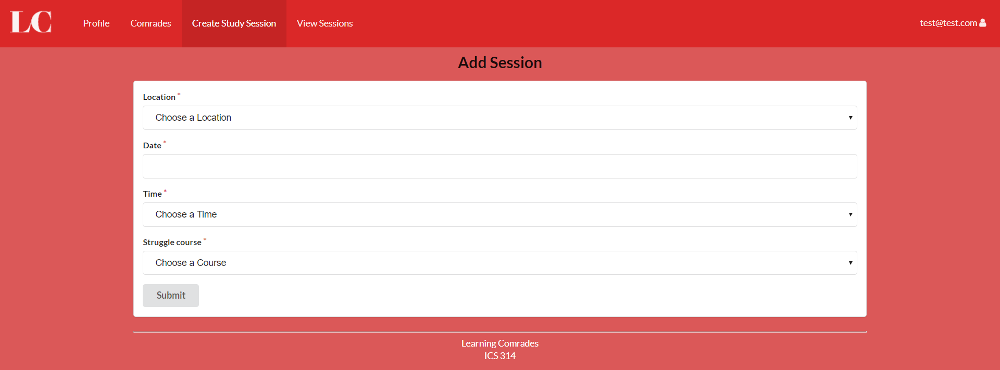
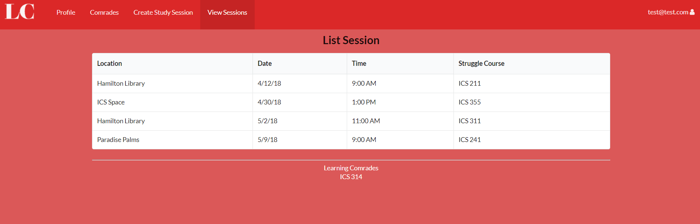

<!--
* [About Learning Comrades](#about-learning-comrades)
* [User's Guide](#user's-guide)
  * [Landing Page](#landing-page)
  * [Login Page](#login-page)
  * [Profile Page](#profile-page)
  * [Create Study Session Page](#create-study-session-page)
  * [Upcoming Study Session Page](#upcoming-study-session-page)
* [Developer Guide](#developer-guide)
* [Community Feedback](#community-feedback)
* [Inital User Study](#inital-user-study)
* [Deployment](#deployment)
* [Development Details](#development-details)
-->
  
 
# About Learning Comrades

Learning Comrades is a UH Manoa ICS 314 [organization](https://github.com/learningcomrades) driven to build a web application that allows ICS students to improve their academic career and find new comrades to assist them in this treacherous journey. We humans are social creatures that want thrive on interaction with others. Learning Comrades is a tool to provide the ICS undergraduate community a new way to learn and socialize.

# User's Guide

## [Landing Page](http://learningcomrades.meteorapp.com/#/)
This is the homepage where students can look at the current avaiable study sessions according to their course that they are struggling in.



## [Login Page](http://learningcomrades.meteorapp.com/#/signin)
The user can register an account and input their login credentials.


## [Profile Page](http://learningcomrades.meteorapp.com/#/add)
The user can create and update their profile.


## [Comrades](http://learningcomrades.meteorapp.com/#/list)
The user can view other comrades that are taking similar courses to them.


## [Create Study Session Page](http://learningcomrades.meteorapp.com/#/create)
Users can create study sessions, coordinating the time, place, and material that they plan to go over.


## [Upcoming Study Session Page](http://learningcomrades.meteorapp.com/#/view)
Users can view the upcoming study sessions they want to go to based on their struggle in specific courses.


# Developer Guide

First, install meteor.

Then in your command line, cd in to your github directory and run this command

```
$ git clone https://github.com/learningcomrades/LearningComrades.git
```

Then cd in to the learning comrades application's app directory and run this command.

```
$ meteor npm install
```

Lastly, you can run it with meteor with:

```
$ meteor npm run start
```

Learning Comrades application will be avaiable at [http://localhost:3000](http://localhost:3000).

# Community Feedback

We chose five ICS students from different class standings to test our app. They understand that ICS is a hard course and some need additonal help outside of a professor's office hours. They enjoyed the simple to use UI where one can quickly create a study session page and coordinate a time and place to study. They find it simple to browse through other user's profiles to quickly get a first impression on them based on their profile picture and the courses that they have already taken.

One tester offered their concerns, stating that this app would have a more widespread appeal if it weren't only for ICS students. Currently the app allows anyone to make an account, however it only offers classes based off on the ICS curriculum. There is the other notion that people wouldn't want to move from their current desired platform (ex. discord, facebook, etc.), as it would take time for students to pick up on Learning Comrades. This could be resolved by promoting this application to incoming ICS students. Students new to discrete math and programming will be able to use this app to coordinate study sessions. 

# Inital User Study

## B. Chun
Major: ICS

Thoughts:
<ul>
 <li>Simple to use and get in to.</li>
 <li>People would have a hard time moving from other platforms to this one.</li>
 </ul>

## R. Imanaka
Major: Bioengineering

Thoughts:
<ul>
 <li>The process of making a profile and a study session is very easy and fast.</li>
 <li>The classes avaiable are only for ICS students which is unforunate as I would like to create study groups for my enginerring courses.</li>
 </ul>

## C. Olinarez
Major: ICS

Thoughts:
<ul>
 <li>It's really helpful to have a group of people discuss the material as certain topics are hard to grasp in class.</li>
 <li>Having only one main color for the website makes it kind of bland. Maybe more cheerful colors will allow more people to take a second look at this app.</li>
 </ul>

## I. Starkey
Major: ICS

Thoughts:
<ul>
 <li>This would have been very useful for ICS 141 students who never touched discrete mathmatics until their freshmen year!</li>
 <li>I would probably still use discord as I can still communicate with all my other non ICS friends.</li>
 </ul>

## N. Samson
Major: ICS

Thoughts:
<ul>
 <li>Your app has a nice layout and design that I can easily navigate through.</li>
 <li>I probably won't use this app in the future because I don't like studying in a group as it drifts to different topics giving me less time to study.</li>
 </ul>

# Deployment

[Deployed Web Application](https://galaxy.meteor.com/app/learningcomrades.meteorapp.com)

# Development Details

[Milestone 1](https://github.com/learningcomrades/LearningComrades/projects/2) 

[Milestone 2](https://github.com/learningcomrades/LearningComrades/projects/3)

[Milestone 3](https://github.com/learningcomrades/LearningComrades/projects/4)

