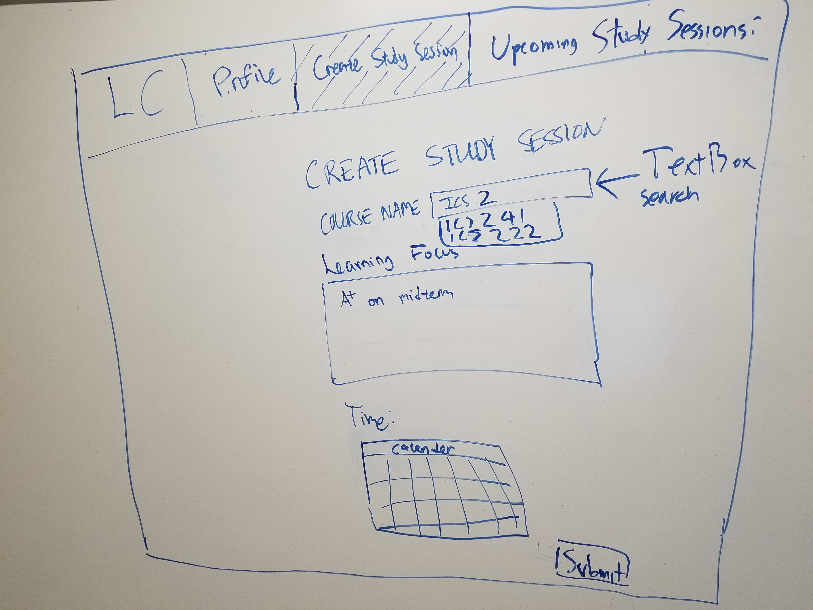
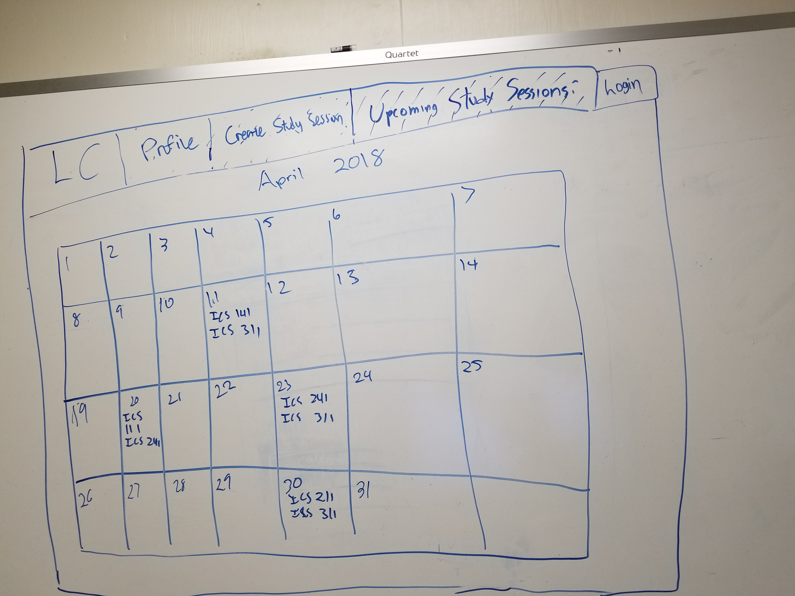

# Table of Contents

* [About Learning Comrades](#about-learning-comrades)
* [Mockup Pages](#mockup-pages)
  * [Landing Page](#landing-page)
  * [Login Page](#login-page)
  * [Profile Page](#profile-page)
  * [Create Study Session Page](#create-study-session-page)
  * [Upcoming Study Session Page](#upcoming-study-session-page)
* [Development Details](#development-details)
* [Deployment](#deployment)
  
 
# About Learning Comrades

Learning Comrades is a UH Manoa ICS 314 [organization](https://github.com/learningcomrades) driven to build a web application that allows ICS students to improve their academic career and find new comrades to assist them in this treacherous journey. We humans are social creatures that want thrive on interaction with others. Learning Comrades is a tool to provide the ICS undergraduate community a new way to learn and socialize.

# Mockup Pages

## [Landing Page](http://learningcomrades.meteorapp.com/#/)
This is the homepage where students can look at the current avaiable study sessions according to their course that they are struggling in.

## [Login Page](http://learningcomrades.meteorapp.com/#/signin)
The user can register an account and input their login credentials.

## [Profile Page](http://learningcomrades.meteorapp.com/#/add)
The user can create and update their profile 

## [Comrades](http://learningcomrades.meteorapp.com/#/list)

## [Create Study Session Page](http://learningcomrades.meteorapp.com/#/create)

## [Upcoming Study Session Page](http://learningcomrades.meteorapp.com/#/view)

# Development Details

[Milestone 1](https://github.com/learningcomrades/LearningComrades/projects/2) 

[Milestone 2](https://github.com/learningcomrades/LearningComrades/projects/3)

[Milestone 3](https://github.com/learningcomrades/LearningComrades/projects/4)

# Deployment

[Deployed Web Application](https://galaxy.meteor.com/app/learningcomrades.meteorapp.com)

